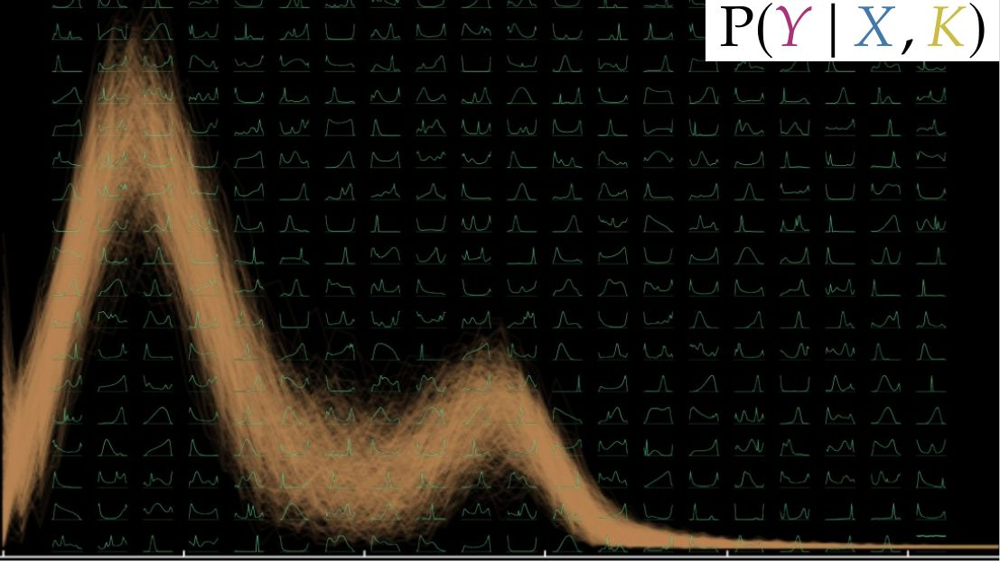
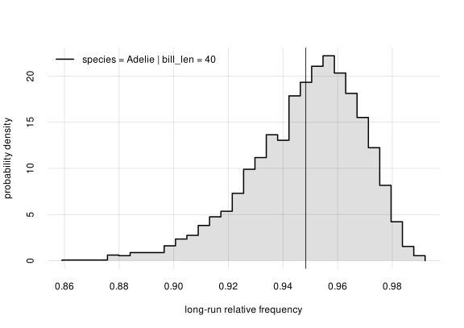
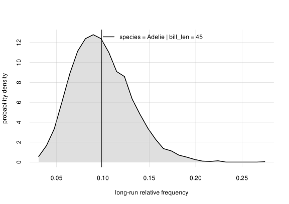

<!-- badges: start -->
[](https://CRAN.R-project.org/package=prova)
[](https://doi.org/10.5281/zenodo.17226082)
[](https://pglpm.r-universe.dev/prova)
<!-- badges: end -->



"prova" /'prɔva/ (Italian)

- [(noun)](https://dictionary.cambridge.org/dictionary/italian-english/prova): test, trial, assessment, proof, evidence, sign, indication, try, attempt.
- [(verb)](https://dictionary.cambridge.org/dictionary/italian-english/provare): test!, try out!, assess!, attempt!, prove!, demonstrate!, show!


# ***Prova***: <br> Probabilistic-statistical variate analysis <br> nonparametric and with automated Markov-chain Monte Carlo

("What's a variate?" Answer here[^1])

An R package to perform probabilistic and statistical data analysis and inference. These are its main features:

- Any combination of **binary**, **nominal**, **ordinal**, **continuous**, **discrete** data. Continuous data can be bounded, unbounded, **censored**, and rounded.
- **No modelling assumptions** such as gaussianity, linearity, or any other kind of model. The analysis and inferences are fully [nonparametric](https://dictionary.apa.org/nonparametric).
- **No assumptions about functional dependence** between data variates. The analysis and inferences are therefore more general than those by neural networks, random forests, or similar machine-learning algorithms.
- **Automatic [imputation](https://dictionary.apa.org/imputation)** of missing data: all sample data are used, even those that lacks some variate values. The imputation is done with a principled method (the marginalization rule of probability theory), rather than ad-hoc procedures.
- Easy and straightforward **subgroup analyses** and **stratified analyses**, for any division of variates, with full statistical details.
- **No hard-coded distinction between "predictor" and "predictand"/target variates** during learning. Any group of variates can be chosen as predictors, and any other group as targets, *on the fly* in each application, without need to re-learn from the training data.
- **Quantification of [generalizability](https://dictionary.apa.org/generalizability)** beyond the finite sample size. In other words, quantification of uncertainty of results regarding the whole, unsampled, population.
- **Computation of expected utilities** and more generally straightforward use with **decision theory**, such as **clinical decision-making**. Users can immediately combine the probabilistic results with any measures of utilities, such as [quality-adjusted life years](https://dictionary.apa.org/quality-adjusted-life-years). Uncertainty about long-run expected utilities is also calculated.
- **Quantification of associations** between any kinds of variates, without modelling assumptions (gaussianity, linearity, etc.), thanks to the use of [mutual information](https://electropedia.org/iev/iev.nsf/display?openform&ievref=171-07-26).
- **[Base-rate](https://dictionary.apa.org/base-rate-fallacy) correction** for inferences about out-of-population data, by means of Bayes's theorem.
- **Automated Markov-chain Monte Carlo** computation. Users unfamiliar with Monte Carlo methods don't have to worry, because the computations are handled automatically.

The package essentially performs Bayesian nonparametric inference (also called "density inference" or "inference under exchangeability"), which makes most features above possible.

<br>

## Minimal example

Use the [R `penguins` dataset](https://stat.ethz.ch/R-manual/R-patched/library/datasets/html/penguins.html) (or download a shuffled version from [here](https://github.com/pglpm/prova/raw/main/vignettes/penguins_shuffled.csv)), together with the metadata `meta_penguins` available in **Prova**. Metadata contain the characteristics of the dataset's variates.

"Learn" from this dataset using the function `learn()`. Note that the dataset has partially missing values (datapoint #4 for instance), but this is not a problem for **Prova**:
```r
K <- learn(data = penguins, metadata = meta_penguins)
# [progress output about the learning computation]
```

The object `K` (for "Knowledge" or "Known") encodes what has been learnt from data and metadata.

Ask a statistical question about the penguin population. For example: given the data we have collected, what is the probability that a *new* penguin from this population is of species *Adélie*, if its bill length is 45 mm? In symbols,

$$
\mathrm{Pr}(\text{species = Adelie} \thinspace\vert\thinspace\mathopen{}
\text{bill len = 45 mm}, K)
$$

where $K$ stands for the knowledge acquired from data and metadata. To answer this question, use the function `Pr()`, and print a summary of the result:
```r
prob <- Pr(
    data.frame(species = 'Adelie'), # predictand
    data.frame(bill_len = 45),      # predictor
    K                               # Knowledge from data & metadata
)

print(prob)
# , , |bill_len = 45
#
#         probability
# species  value   +/-     Q5.5%   Q25%    Q75%    Q94.5%
#   Adelie 0.09857 0.00053 0.05337 0.07534 0.11893 0.1527
```
The answer is that there is roughly a 10% probability that a new penguin, among those with a 45 mm bill length, is of species *Adélie*.

Now ask: what is the relative frequency of *Adélie* species *in the whole subpopulation* (including unsampled penguins), of penguins having bill length of 45 mm? This cannot be answered with certainty, because we have only a sample of the full population. But **Prova** can calculate the *probability distribution* for this full-population frequency. In fact, it has already been calculated by the function `Pr()` above, and we can visualize it with a plot:
```r
hist(prob)
```


The plot shows that this full-population frequency is most likely (with roughly 90% probability) between 0.05 and 0.15. These are the values shown by `print(prob)` above.

The *inverse* question can also be asked: if we observe a new penguin of *Adélie* species, what could its bill length be? The answer is uncertain, and **Prova** can calculate the probability distribution of the penguin's bill length:
```r
invprob <- Pr(
    data.frame(bill_len = seq(30, 50, by = 0.5)), # predictand
    data.frame(species = 'Adelie'),               # predictor
    K                                             # knowledge
)

plot(invprob)
```


this probability distribution has a peak between 35 mm and 40 mm and it's slightly skewed.

This distribution is not the *frequency* distribution of bill length in the whole subpopulation of *Adélie* penguins; the latter is uncertain because we have only a sample. But the plot above shows that the full-population frequency distribution is somewhere between the grey bands.

</br>

This was just a minimal example, just touching on the basic functionality. More complex combinations of variates and more complex probabilistic-statistical questions can be approached.

The [introductory vignette](https://pglpm.github.io/prova/articles/intro.html) explains, with a guided example, most of the features above, as well as the main ideas and functions. It can be particularly useful for researchers who are more familiar with traditional "frequentist" statistics but would like to try the Bayesian approach. See the [post](https://www.apadivisions.org/division-7/publications/newsletters/developmental/2018/07/bayesian-statistics) by Barbara W. Sarnecka, frequentist statistician turned Bayesian, for a brilliant overview of the Bayesian advantages. The [vignette about mutual information](https://pglpm.github.io/prova/articles/mutualinfo.html) explains the use of this powerful measure of association.

The package is under continuous development, but the core functionalities work and have been tested in concrete research projects; see [example applications](#example-applications) below.

The package internally does the computations necessary for Bayesian inference by means of Monte Carlo methods thanks to the R package [**Nimble**](https://r-nimble.org/). As already mentioned, this computation is automated. Users familiar with Monte Carlo methods can still access computational details and can even change some of the computation hyperparameters.

## Installation

**You need to have installed the package [**Nimble**](https://r-nimble.org/), *at least version 1.4.2*.** Please follow [Nimble's installation instructions](https://r-nimble.org/manual/cha-installing-nimble.html) for your operating system.

Then **Prova** can be installed from [CRAN](https://CRAN.R-project.org/package=prova) with
```r
install.packages('prova')
```

In case of a newer version not yet on CRAN, it can be installed with
```r
remotes::install_github('pglpm/prova')
```

## Documentation

The vignette [*An introduction to probabilistic-statistical variate analysis*](https://pglpm.github.io/prova/articles/intro.html) is a step-by-step introduction to **Prova** and also to Bayesian nonparametrics. It guides you through a concrete example with various kinds of inferences. You may also try to follow it using a dataset of your own.

Other tutorials are available at [pglpm.github.io/prova](https://pglpm.github.io/prova/), or can be accessed in an R session with `browseVignettes('prova')`.

A summary of the theoretical foundations, including further references, is available in [this draft](https://github.com/pglpm/prova/raw/main/development/manual/pglpm2024-bayes_nonparam.pdf). The main idea for the internal mathematical representation comes from [Dunson & Bhattacharya](https://doi.org/10.1093/acprof:oso/9780199694587.003.0005) and [Ishwaran & Zarepour](https://doi.org/10.2307/3315951).

For a low-level course on Bayesian nonparametric inference and Decision Theory see [Data Science and AI Prototyping](https://pglpm.github.io/ADA511/).


## Example applications

- [*Personalized prognosis & treatment using an optimal predictor machine: An example study on conversion from Mild Cognitive Impairment to Alzheimer's Disease*](https://doi.org/10.31219/osf.io/8nr56).

- [*Don't guess what's true: choose what's optimal. A probability transducer for machine-learning classifiers*](https://doi.org/10.31219/osf.io/vct9y)

- [*Does the evaluation stand up to evaluation? A first-principle approach to the evaluation of classifiers*](https://doi.org/10.31219/osf.io/7rz8t)

- [*Calibrated and uncertain? Evaluating uncertainty estimates in
binary classification models*](https://doi.org/10.1088/2632-2153/ae45ed)


## Projects using **Prova**:

- [InfernoCalibNet](https://inferno.m4siko.cc/): uncertainty-aware predictions for medical AI using CNN and Bayesian nonparametrics framework
- [parkinsonbayes](https://github.com/pglpm/parkinsonbayes/): Examples of Bayesian nonparametric inference for studies of Parkinson's Disease
- [Inferno-App](https://github.com/Myddis/Inferno-App/): PySide6 application that integrates Python and R functionality using the **Inferno** (old version of **Prova**) R package.


## Contact

Please report bugs and request features or specific documentation on [GitHub Issues](https://github.com/pglpm/prova/issues).
If you have other questions about application, theory, technical implementation, feel free to contact Luca <pglXYZ@portamanaXYZ.org> (remove 'XYZ' for anti-spam purposes).


## Disclaimer

No large language models were used in the production of this software and of its documents.


[^1]: [*variate*](https://archive.org/details/conciseoxfordeng0000unse_i8l8/page/1598/mode/1up): "a quantity having a numerical value for each member of a group, especially one whose values occur according to a frequency distribution." (Concise Oxford English Dictionary).<br>[*variable*](https://archive.org/details/conciseoxfordeng0000unse_i8l8/page/1598/mode/1up): "a factor or quantity able to assume different numerical values" (Concise Oxford English Dictionary).
